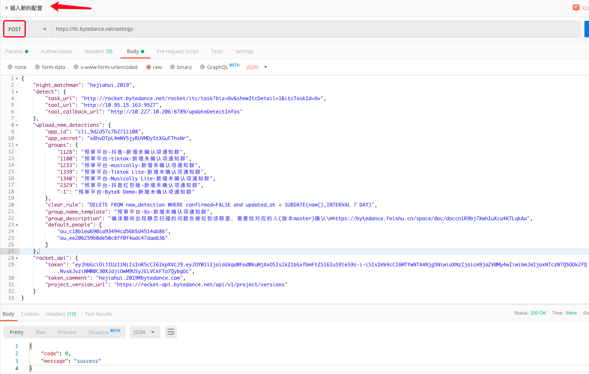

# itc-server

## 运行程序

```bash
cd ~/go/src/code.byted.org/clientQA/itc-server
bash run.sh
```

## 加入我们

### 拉取代码

```Bash
mkdir -p ~/go/src/code.byted.org/clientQA
cd ~/go/src/code.byted.org/clientQA
git clone git@code.byted.org:clientQA/itc-server.git
```

## 一些建议

使用数据库时，请考虑使用`database.DB()`的方式，该方法会返回一个全局的数据库句柄，全局数据库句柄会在`main`函数中初始化。采用这种方式有两个好处：

- 减少代码冗余，数据库句柄仅初始化一次，全局可用。

- 数据库句柄限制为包级可见，可避免不知情的修改，提高代码的健壮性。

如果想在数据库中`插入/删除`记录，请考虑使用下面这两个函数，目前可以在`database`包中找到它们：

```Go
// DeleteDBRecord deletes all eligbile record in the given database table.
// Note that the parameter table should be the instance or pointer of the struct
// mapping to the table and table name will be invalid.
// If the model has a DeletedAt field, it will get a soft delete ability
// automatically, which means the record will not be permanently removed
// from the database, rather the DeletedAt' value will be set to the current time.
func DeleteDBRecord(db *gorm.DB, table interface{}, sieve map[string]interface{}) error {

	if err := db.Debug().Delete(table, sieve).Error; err != nil {
		logs.Error("database error: %v", err)
		return err
	}

	return nil
}

// InsertDBRecord inserts record into database if it is valid.
// Note that the parameter record must be the pointer of the struct mapping to
// the target table.
// If the operation succeeded, record.ID is exact the id of the inserted record.
func InsertDBRecord(db *gorm.DB, record interface{}) error {

	if err := db.Debug().Create(record).Error; err != nil {
		logs.Error("database error: %v", err)
		return err
	}

	return nil
}

// UpdateDBRecord updates the specific record if it is valid.
// Note that the parameter record must be the pointer of the struct mapping to
// the target table and the primary key of record must be valid.
// WARNING: when update with struct, GORM will only update those fields
// that with non blank value. So it is necessary to update the status of
// detect task with a new function.
func UpdateDBRecord(db *gorm.DB, record interface{}) error {

	if err := db.Debug().Model(record).Updates(record).Error; err != nil {
		logs.Error("database error: %v", err)
		return err
	}

	return nil
}
```

使用示例：

```Go
	if err := database.InsertDBRecord(database.DB(), &dal.DetectContent{
		TaskId:      int(task.ID),
		ToolId:      toolID,
		HtmlContent: htmlContent,
		JsonContent: jsonContent,
	}); err != nil {
		logs.Error("%s store content error: %v", msgHeader, err)
		return
	}
```

对于网络请求的响应，请考虑使用下面这个函数，目前可以在`utils`包中找到它：

**注意** 对于新增的接口，尤其建议使用该函数，目的是规范返回参数，统一使用`code`、`message`、`data`。(前端接口已兼容，所以大胆修改吧)

```Go
// ReturnMsg return the response to requester.
// If the data is not empty, only the first data will be accept while the rest
// will be abandoned.
func ReturnMsg(c *gin.Context, httpCode int, code int, msg string,
	data ...interface{}) {

	switch code {
	case FAILURE:
		logs.Error(msg)
	case SUCCESS:
		logs.Debug(msg)
	default:
		logs.Notice("unsupport code (%v): %v", code, msg)
	}

	obj := gin.H{"code": code, "message": msg}
	if len(data) > 0 {
		obj["data"] = data[0]
	}

	c.JSON(httpCode, obj)

	return
}
```

使用示例：

```Go
	username, exist := c.Get("username")
	if !exist {
		utils.ReturnMsg(c, http.StatusUnauthorized, utils.FAILURE, "unauthorized user")
		return
	}
	var p confirmParams
	if err := c.ShouldBindJSON(&p); err != nil {
		utils.ReturnMsg(c, http.StatusOK, utils.FAILURE, fmt.Sprintf("invalid parameter: %v", err))
		return
	}
```

发送网络请求，请考虑使用下面这个函数，目前可以在`utils`包找到它：

```Go
// SendHTTPRequest uses specific method sending data to specific URL
// via HTTP request.
func SendHTTPRequest(method string, url string, params map[string]string, headers map[string]string,
	data []byte) ([]byte, error) {

	// Construct HTTP handler
	req, err := http.NewRequest(method, url, bytes.NewBuffer([]byte(data)))
	if err != nil {
		logs.Error("construct HTTP request failed: %v", err)
		return nil, err
	}

	// Add query parameters
	q := req.URL.Query()
	for k, v := range params {
		q.Add(k, v)
	}
	req.URL.RawQuery = q.Encode()

	// Set request header
	for k, v := range headers {
		req.Header.Set(k, v)
	}
	logs.Debug("%v", req)

	// Send HTTP request
	client := &http.Client{}
	resp, err := client.Do(req)
	if err != nil {
		logs.Error("send HTTP request failed: %v", err)
		return nil, err
	}
	defer resp.Body.Close()

	// Read HTTP response
	body, err := ioutil.ReadAll(resp.Body)
	if err != nil {
		logs.Error("read content from HTTP response failed: %v", err)
		return nil, err
	}
	logs.Debug("%s", body)

	return body, err
}
```

使用示例：

```Go
	body, err := utils.SendHTTPRequest("GET",
		settings.Get().RocketAPI.ProjectVersionURL,
		map[string]string{
			"project":      project,
			"biz":          biz,
			"achieve_type": os_type,
			"version_code": new_version,
			"nextpage":     "1"},
		map[string]string{
			"token": settings.Get().RocketAPI.Token}, nil)
	if err != nil {
		logs.Error("send http request error: %v", err)
		return "", "", err
	}
```

## 一些坑...

毫无疑问代码中有很多坑，不过大部分都不是我挖的:)

下面介绍一个我挖的坑。

为了实现高度灵活的配置化，同时尽量避免上线操作，我增加了一个`settings`包，该包中包含了一个全局句柄，它指向了一些自定义的配置，配置对应了数据库表`settings_history`的`content`字段内容，每次程序启动时都会获取表中最新一条配置。

> 如何使用？

1. 拷贝最新一份配置，即`content`字段对应的内容。以`created_at`字段为准。

2. 修改配置中的目标字段。最好用可以编辑json的工具。

3. 调用增加配置接口。


**警告** 调用线上接口时请三思。

注意这里是修改，而不是新增。新增字段需要修改相应的代码，并重新上线。

回退当然也是可以的，删除最新一条配置，然后调用刷新接口即可。

目前只配置了一小部分，理论上代码中所有的常量都可以使用此种方式配置，这是一个长期的过程。

使用示例：

